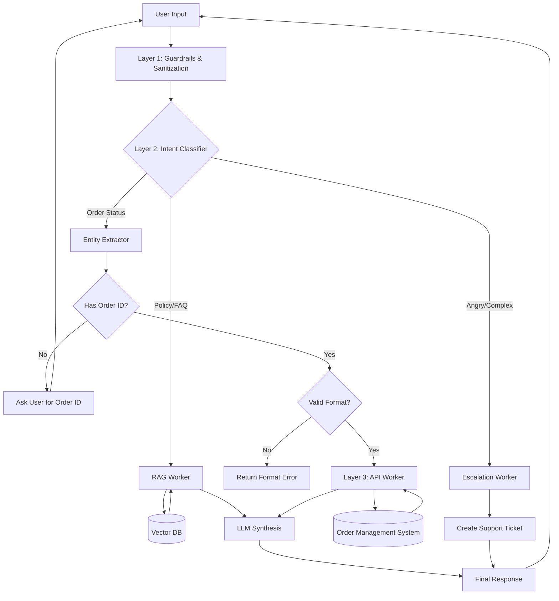

# 🤖 AI-Powered E-Commerce Support Agent

A production-ready, multi-layered AI customer support system designed for e-commerce platforms.

This system intelligently handles:

- Order Tracking (Transactional Queries)
-  Policy & FAQ Queries (RAG-based)
-  Multi-turn Conversations with State
-  Frustration Detection & Escalation
-  PII Redaction & Guardrails
-  Secure Tool Calling with Validation

---

---

# 📐 System Architecture

The architecture follows an **Orchestrator–Worker pattern** divided into four layers:

```
Interface Layer → Cognitive Layer → Service Layer → Data Layer
```

---

## 📊 Visual Decision Flow

The following diagram illustrates the agent's logic from receiving a user query to delivering a response.



---

# 🛡 Layer 1: Interface & Guardrails (The Gatekeeper)

This layer protects the system before any data reaches the LLM.

## Responsibilities

### 1️⃣ Input Sanitization
- Removes injection patterns
- Blocks system prompt overrides
- Cleans malicious payloads

### 2️⃣ PII Redaction
Detects and masks:
- Credit Card Numbers
- Phone Numbers
- Email Addresses

Sensitive data is only exposed when required for verified transactions.

### 3️⃣ Safety Filtering
- Detects toxic/manipulative content
- Prevents competitor comparisons
- Blocks out-of-scope requests

---

# 🧠 Layer 2: Cognitive Orchestrator (The Brain)

The decision-making engine.

> It decides what to do. It does NOT execute tasks directly.

## Components

### Intent Classifier

Classifies user input into:

- `POLICY_QUERY`
- `ORDER_STATUS`
- `ESCALATION`

### Context Manager

Maintains:

- Conversation state
- Previously provided order IDs
- Follow-up attempts
- Retry count

### Slot / Entity Filler

Ensures required parameters exist before tool execution.

Example:
- Order ID required for `ORDER_STATUS`
- If missing → Ask user for ID

---

# 🛠 Layer 3: Functional Workers (The Tools)

Triggered by the Orchestrator.

---

## 🔎 RAG Worker (Knowledge Retrieval)

Used for informational queries.

### Flow

1. Convert query → vector embedding
2. Search Vector DB
3. Retrieve top-K relevant chunks
4. LLM synthesizes answer

---

## 📦 API Worker (Transactional Queries)

Handles live order tracking.

### Flow

1. Validate Order ID format
2. Call backend API
3. Return structured JSON
4. Convert JSON → Natural language

---

## 🙋 Escalation Worker

Triggered when:
- High user frustration
- Repeated failure
- Refund demand
- Sentiment spike

### Actions

- Log conversation summary
- Create CRM ticket
- Generate ticket ID
- Notify human agent

---

# 🗄 Layer 4: Data & Backend

| Component | Technology | Purpose |
|------------|------------|----------|
| LLM | GPT-4o / Gemini 1.5 Pro | Reasoning & Tool Calling |
| Framework | LangGraph | Cyclic workflows |
| Backend | FastAPI | Async API handling |
| Vector DB | Pinecone / Milvus | RAG retrieval |
| Database | PostgreSQL / MongoDB | Orders & users |
| Validation | Pydantic + RegEx | Strict schema enforcement |
| Guardrails | NeMo Guardrails | Safety enforcement |

---

# 🔄 Reasoning Loop

The system follows:

```
Observe → Classify → Evaluate → Validate → Act → Synthesize
```

---

# 📊 Process Flows

---

## Flow A: Informational Query (RAG)

**User:**  
"What is your return policy for electronics?"

**Steps:**
1. Intent → `POLICY_QUERY`
2. Route → RAG Worker
3. Retrieve relevant chunks
4. Generate response

**Output Example:**
> Electronics can be returned within 15 days if unopened and in original packaging.

---

## Flow B: Operational Query (Happy Path)

**User:**  
"Check status for Order #ABC-123"

**Steps:**
1. Intent → `ORDER_STATUS`
2. Extract order_id = `ABC-123`
3. Validate format
4. Call API
5. Format response

**Output Example:**
> Your order #ABC-123 is Out for Delivery and will arrive by 5 PM.

---

## Flow C: Missing Information (Loop)

**User:**  
"Where is my order?"

**Steps:**
1. Intent → `ORDER_STATUS`
2. No order_id found
3. Ask follow-up

**Agent:**
> Please provide your Order ID.

(User replies with ID → System loops back to Flow B)

---

## Flow D: Escalation

**User:**  
"I’ve asked three times and my order is still missing! I want a refund!"

**Steps:**
1. Sentiment analysis detects high negativity
2. Trigger `ESCALATION_PROTOCOL`
3. Create CRM ticket

**Response:**
> I apologize for the frustration. I am escalating this to a human specialist. Your ticket ID is #999.

---
