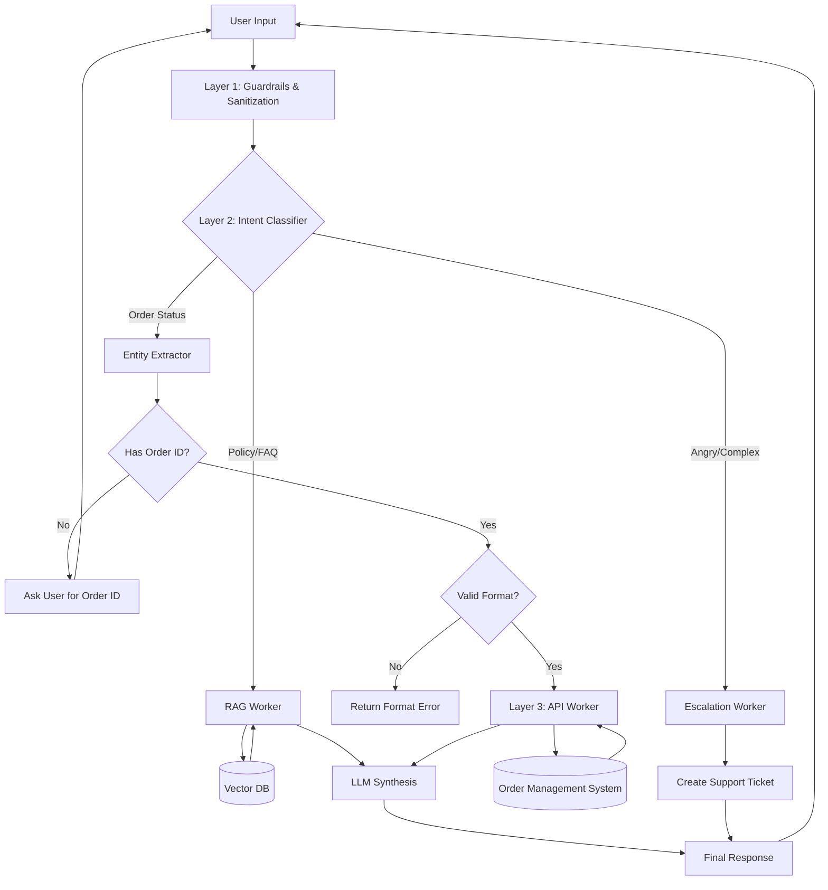

# AI-Powered E-Commerce Support Agent

A production-ready, multi-layered AI customer support system designed for e-commerce platforms.

This system intelligently handles:

- Order Tracking (Transactional Queries)
-  Policy & FAQ Queries (RAG-based)
-  Multi-turn Conversations with State
-  Frustration Detection & Escalation
-  PII Redaction & Guardrails
-  Secure Tool Calling with Validation

---

---

#  System Architecture

The architecture follows an **Orchestrator–Worker pattern** divided into four layers:

```
Interface Layer → Cognitive Layer → Service Layer → Data Layer
```

---

## 📊 Visual Decision Flow

The following diagram illustrates the agent's logic from receiving a user query to delivering a response.



---

# Layer 1: Interface & Guardrails (The Gatekeeper)

This layer protects the system before any data reaches the LLM.

## Responsibilities

### 1️⃣ Input Sanitization
- Removes injection patterns
- Blocks system prompt overrides
- Cleans malicious payloads

### 2️⃣ PII Redaction
Detects and masks:
- Credit Card Numbers
- Phone Numbers
- Email Addresses

Sensitive data is only exposed when required for verified transactions.

### 3️⃣ Safety Filtering
- Detects toxic/manipulative content
- Prevents competitor comparisons
- Blocks out-of-scope requests

---

# 🧠 Layer 2: Cognitive Orchestrator (The Brain)

The decision-making engine.

> It decides what to do. It does NOT execute tasks directly.

## Components

### Intent Classifier

Classifies user input into:

- `POLICY_QUERY`
- `ORDER_STATUS`
- `ESCALATION`

### Context Manager

Maintains:

- Conversation state
- Previously provided order IDs
- Follow-up attempts
- Retry count

### Slot / Entity Filler

Ensures required parameters exist before tool execution.

Example:
- Order ID required for `ORDER_STATUS`
- If missing → Ask user for ID

---

# 🛠 Layer 3: Functional Workers (The Tools)

Triggered by the Orchestrator.

---

## 🔎 RAG Worker (Knowledge Retrieval)

Used for informational queries.

### Flow

1. Convert query → vector embedding
2. Search Vector DB
3. Retrieve top-K relevant chunks
4. LLM synthesizes answer

---

## 📦 API Worker (Transactional Queries)

Handles live order tracking.

### Flow

1. Validate Order ID format
2. Call backend API
3. Return structured JSON
4. Convert JSON → Natural language

---

## 🙋 Escalation Worker

Triggered when:
- High user frustration
- Repeated failure
- Refund demand
- Sentiment spike

### Actions

- Log conversation summary
- Create CRM ticket
- Generate ticket ID
- Notify human agent

---

# 🗄 Layer 4: Data & Backend

| Component | Technology | Purpose |
|------------|------------|----------|
| LLM | GPT-4o / Gemini 1.5 Pro | Reasoning & Tool Calling |
| Framework | LangGraph | Cyclic workflows |
| Backend | FastAPI | Async API handling |
| Vector DB | Pinecone / Milvus | RAG retrieval |
| Database | PostgreSQL / MongoDB | Orders & users |
| Validation | Pydantic + RegEx | Strict schema enforcement |
| Guardrails | NeMo Guardrails | Safety enforcement |

---

#  Reasoning Loop

The system follows:

```
Observe → Classify → Evaluate → Validate → Act → Synthesize
```

---

---

## 🛠️ Tech Stack

| Component | Technology | Justification |
| :--- | :--- | :--- |
| **Framework** | **LangGraph** | Enables cyclic flows (loops) essential for multi-turn conversations and state management. |
| **LLM** | **Gemini 1.5 Pro / GPT-4o** | High reasoning capability to minimize hallucinations and handle complex routing. |
| **Vector DB** | **Pinecone / Milvus** | Low-latency retrieval of policy documents for RAG. |
| **Validation** | **Pydantic & RegEx** | Enforces strict data structures to prevent API errors. |
| **Backend** | **FastAPI** | High-performance async framework for handling concurrent agent requests. |
| **Guardrails** | **NeMo Guardrails** | Ensures the agent stays on topic and safe. |

---
# 📂 Project File Structure

The project is organized to separate the **API Interface**, **Agent Logic**, and **Data Sources**.

```text
ecommerce-agent/
├── app/
│   ├── __init__.py
│   ├── main.py              # 🚀 Entry point: FastAPI server setup
│   ├── api/                 # 🔌 API Routes
│   │   ├── chat.py          # Endpoint for chat widget
│   │   └── mock_oms.py      # Simulated Order Management System (OMS)
│   ├── agent/               # 🧠 The Cognitive Layer
│   │   ├── graph.py         # LangGraph state machine definition
│   │   ├── router.py        # Intent classification logic
│   │   ├── tools.py         # Tool definitions (Order API, RAG Search)
│   │   ├── state.py         # State schema (AgentState)
│   │   └── prompts.py       # System prompts for Router & Generator
│   └── utils/               # 🛠 Helpers
│       ├── guardrails.py    # PII redaction & input sanitization
│       └── ingest.py        # Script to load policies into Vector DB
├── data/                    # 📄 Raw Knowledge Base
│   └── policies.txt         # Text file containing return policies/FAQs
├── chroma_db/               # 🗄️ Persisted Vector Database (Generated)
├── tests/                   # 🧪 Red Teaming & Unit Tests
│   ├── test_agent.py
│   └── test_security.py
├── .env                     # 🔑 API Keys (OpenAI, Pinecone, Database URL)
├── requirements.txt         # 📦 Python Dependencies
└── README.md                # 📖 Documentation
